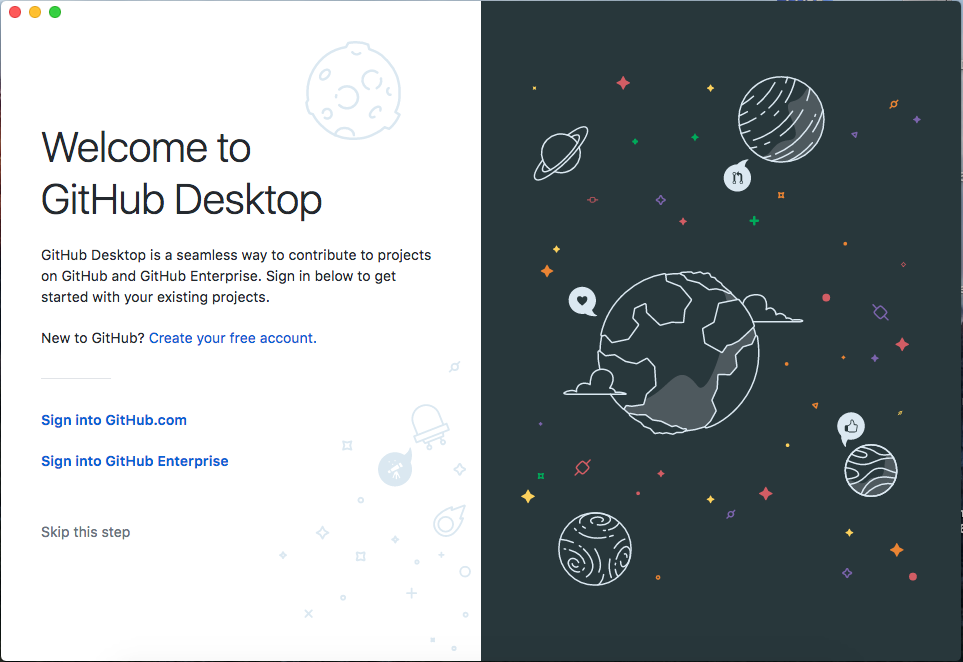

# ¿QUÉ ES GIT?
- Git es un sistema de control de versiones (VCS, por sus siglas en inglés), diseñado para llevar un registro de cambios en los archivos de un proyecto en el que trabajan una o más personas.
- Fue desarrollado por Linus Torvalds, el creador de Linux, en 2005, con el objetivo de ayudar a la comunidad open source a colaborar en proyectos de software, haciendo un manejo y seguimiento de los cambios propuestos por cada participante.

# ¿CÓMO FUNCIONA? / COMMITS y BRANCHES
- Un repositorio Git es un directorio en tu disco duro, en donde todos los cambios a los archivos son rastreados por Git.
- Git mantiene una versión master del proyecto (master branch) y tiene un registro de todos los cambios (commits) que han ocurrido en ella. Gráficamente, cada commit es un nodo, ligado a un commit anterior y a uno posterior.

- En cualquier momento es posible regresar a cualquier commit y seguir trabajando desde ese punto.

# RAMAS (BRANCHES) y MERGES
- Si un usuario quiere trabajar en una línea paralela, dejando la versión principal de su proyecto intacta, puede generar una nueva rama, a partir de cualquier commit en la historia.

- El usuario que puede elegir a qué rama quiere enviar sus cambios (en qué rama hace sus commits).
- La nueva rama puede ser integrada (merge) con la rama master más adelante.

# ÁREA DE TRABAJO
- Los nodos (commits) en las gráficas anteriores, representan versiones estables del proyecto. Es decir, no es deseable que cambios que hace un autor mientras desarrolla sus ideas se vean reflejados de inmediato en estas versiones. Una vez que el autor está convencido de sus modificaciones es que hace un commit para integrarlos.
Para esto, Git tiene un área de trabajo. Los cambios que haga el usuario a los archivos en el área de trabajo no se verán reflejados en ninguna de las ramas rastreadas por Git sino hasta que el autor haga un commit, que integra los cambios hechos en el área de trabajo a la rama que el usuario elija. El commit actualiza la rama, agregando un nuevo nodo al final.

# ¿CÓMO COLABORAR CON GIT?
- Todo lo que hemos mencionado hasta ahora sucede localmente en la computadora de un usuario. Pero los mismos principios se utilizan para colaborar con un equipo de personas, cada una de las cuales tendrá una copia local del repositorio en su disco duro.
- Flujo de trabajo para colaborar con Git:
 1. Se define un repositorio de origen (origin) que puede ser guardado en un servidor propio, o en sitios como GitHub o GitLab.
 2. Los participantes clonan (clone) el repositorio origin en sus computadoras, generando una copia local, que pueden modificar sin temor de que sus cambios entren en conflicto con los de otros participantes.
 3. Un colaborador modifica los archivos en su área de trabajo local.
 4. El colaborador hace un commit con estos cambios, actualizando alguna de las ramas de su repositorio local.
 5. El colaborador envía un pull request al repositorio origen, para que los administradores revisen y, en su caso, acepten los cambios y sean integrados (merge).
 6. Los demás colaboradores descargan los cambios propuestos (fetch), y los integran (merge) a sus ramas locales.

# GUÍA PASO A PASO PARA COLABORAR CON GIT Y GITHUB

- Ve a https://github.com y crea una cuenta.
- Descarga e instala un cliente git (por ejemplo: https://desktop.github.com)

- Ingresa los datos de tu cuenta de GitHub
- Elige la opción "Clone a Repository":
https://desktop.github.com)

- En el primer campo, ingresa la dirección de este repositorio (https://github.com/dacocp/AprendeGit) y en el segundo, la ruta donde desees guardar la copia local (se sugiere dejarlo como está):

