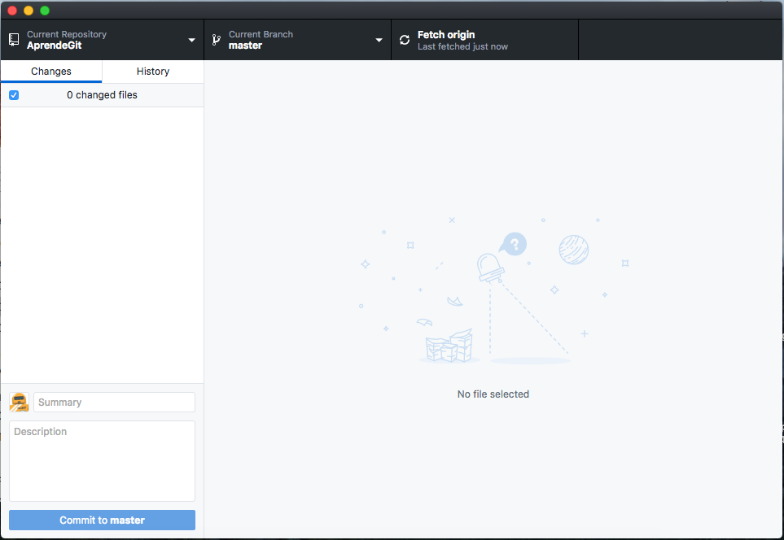
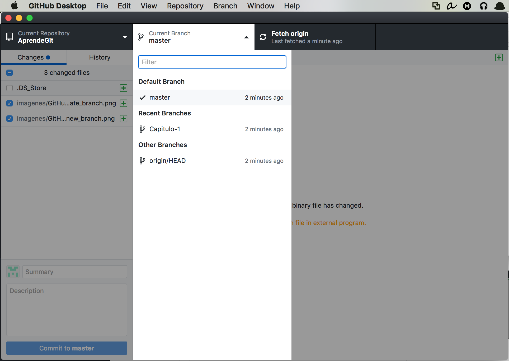
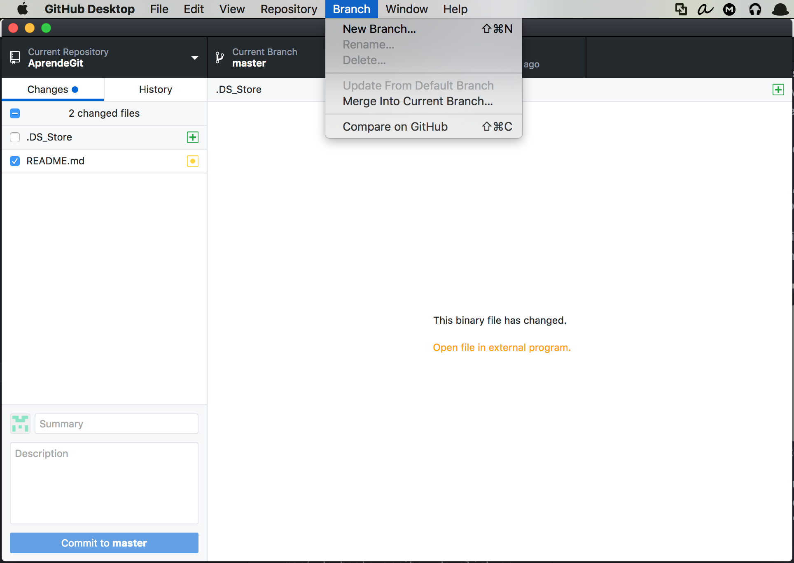
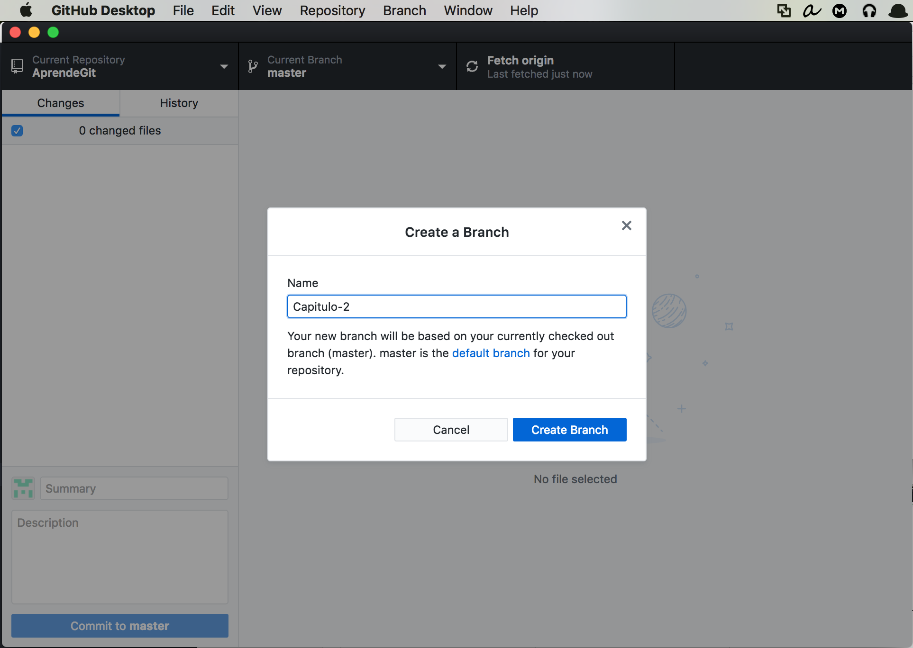

# ¿QUÉ ES GIT?
- Git es un sistema de control de versiones (VCS, por sus siglas en inglés), diseñado para llevar un registro de cambios en los archivos de un proyecto en el que trabajan una o más personas.

- Fue desarrollado por Linus Torvalds, el creador de Linux, en 2005, con el objetivo de ayudar a la comunidad open source a colaborar en proyectos de software, haciendo un manejo y seguimiento de los cambios propuestos por cada participante.

# ¿CÓMO FUNCIONA? / _commits_ y BRANCHES
- Un repositorio Git es un directorio en tu disco duro, en donde los cambios a los archivos son rastreados, de manera que se puede regresar a cualquier versión del pasado.

- Git mantiene el registro de los cambios importantes que ocurren en el repositorio. El usuario trabaja sobre copias de los archivos del proyecto (más sobre esto en la sección "Área de trabajo", más adelante), y cuando está convencido de sus avances hace un _commit_, que actualiza el repositorio para incluirlos. Los _commits_ enviados por el usuario, se van encadenando, uno tras otro, para guardar un histórico completo. Gráficamente, cada _commit_ es un nodo, ligado a un _commit_ anterior y a uno posterior.

- En cualquier momento es posible regresar a cualquier _commit_ y seguir trabajando desde ese punto.

# RAMAS (BRANCHES) y MERGES
- Si un usuario quiere trabajar en una línea paralela, dejando la versión principal de su proyecto intacta, puede generar una nueva rama, a partir de cualquier _commit_ en la historia.

- El usuario que puede elegir a qué rama quiere enviar sus cambios (en qué rama hace sus _commits_).
- La nueva rama puede ser fusionada (_merge_) con la rama _master_ más adelante; sólo será necesario resolver los posibles conflictos, si es que la rama principal también fue modificada. Como se observa en la figura, mientras el usuario trabajó en la rama "Some Feature" haciendo dos _commits_, también hizo un _commit_ en la rama _master_, de manera que al fusionar (_merge_) es posible que tenga que resolver conflictos entre archivos.

# ÁREA DE TRABAJO
- Los nodos (_commits_) en las gráficas anteriores, representan versiones "estables" del proyecto. Es decir, no es deseable que cambios que hace un autor mientras desarrolla sus ideas se vean reflejados de inmediato en las versiones rastreadas por Git.

- Para esto, un repositorio Git, además de rastrear versiones pasadas, tiene un _área de trabajo_ (_workspace_). Los cambios que haga el usuario a los archivos en el _workspace_ no se verán reflejados en ninguna de las ramas rastreadas por Git sino hasta que el autor haga un _commit_, que integrará los cambios hechos en los archivos del _workspace_ a la rama que el usuario elija. El _commit_ actualiza la rama, agregando un nuevo nodo al final.

# ¿CÓMO COLABORAR CON GIT?
- Todo lo que hemos mencionado hasta ahora sucede localmente en la computadora de un usuario. Pero los mismos principios se utilizan para colaborar con un equipo de personas, cada una de las cuales tendrá una copia local del repositorio en su disco duro.
- Flujo de trabajo para colaborar con Git:
 1. Se define un repositorio de origen (_origin_) que puede ser guardado en un servidor propio, o en sitios como GitHub o GitLab.
 2. Los participantes clonan (_clone_) el repositorio _origin_ en sus computadoras, generando una copia local, que pueden modificar sin temor de que sus cambios entren en conflicto con los de otros participantes.
 3. Un colaborador modifica los archivos en su área de trabajo local.
 4. El colaborador hace un _commit_ con estos cambios, actualizando alguna de las ramas de su repositorio local.
 5. El colaborador envía un _pull request_ (ya hablaremos de esto) al repositorio origen, para que los administradores revisen y, en su caso, acepten los cambios y sean integrados (_merge_).
 6. Los demás colaboradores descargan los cambios propuestos (_fetch_), y los integran (_merge_) a sus ramas locales.

# GUÍA PASO A PASO PARA COLABORAR CON GIT Y GITHUB

1. Ve a https://github.com y crea una cuenta.

2. Descarga e instala el cliente git GitHub Desktop:
   https://desktop.github.com

3. Elige la opción "Sign into Github.com" e los datos de tu cuenta de GitHub

4. Elige la opción "Clone a Repository":
https://desktop.github.com)

5. En el primer campo, ingresa la dirección de este repositorio (https://github.com/dacocp/AprendeGit) y en el segundo, la ruta donde desees guardar la copia local (se sugiere dejarlo como está por default). Guarda o memoriza esta ruta, ya que ahí quedarán almacenados los archivos del proyecto.

6. Si todo salió bien, el repositorio Git ha sido _clonado_ a tu disco duro, y podrás ver sus archivos en la ruta que ingresaste (o que dejaste por default) en el inciso anterior.

7. En la pantalla siguiente, verás  la lista de cambios en tu área de trabajo, que no han sido sincronizados (_commit_) con tu _master branch_. Como el repositorio está recién clonado, debe mostrar: _0 changed files_

8. En esta pantalla podrás interactuar con tu repositorio local para hacer _commits_ y actualizar repositorio local, pero también para interactuar con el repositorio remoto _origin_.

9. Deja la pantalla de GitHub Desktop abierta y en un navegador busca y descarga un editor de Markdown (por ejemplo: http://markdownpad.com). Una vez descargado, instalalo en tu computadora.

10. Abre tu editor de Markdown. Da click en "File" -> "Open" y busca el archivo "Readme.md" en el directorio en donde se guardó el clon de este repositorio Git (en el paso 5 elegiste la ruta donde se guardarían los archivos).

11. Verás el código Markdown de esta guía y podrás editarlo. Pero antes de que lo hagas, primero regresa a la pantalla de GitHub Desktop.

12. Cuando utilices GitHub para colaborar, hay que seguir buenas prácticas, que faciliten la convivencia y colaboración. En general, es de mala educación modificar la rama _master_ del repositorio público (que es de todos), sin solicitar la revisión de otros colaboradores. Por ello, es buena práctica crear nuevas ramas (_branch_) y trabajar sobre ellas, hasta que las modificaciones propuestas estén suficientemente "maduras". Cuando la versión de la rama que hayas creado esté lista, podrá ser fusionada con la rama principal.

12. Revisa si existen otras ramas activas en el repositorio, dando click en donde dice "Current Branch".

Elige la rama master, por lo pronto.

13. Crea una nueva rama para tus cambios. En GitHub desktop, en el menú de hasta arriba, da click en "Branch" -> "New Branch".

14. Escribe el nombre de tu nueva rama, por ejemplo, "Capitulo-2" (los nombres de las ramas no aceptan espacios). Si ya existe una rama con este nombre, intenta "Capitulo-3", "Capitulo-4", etc.

15. Ahora actualiza el repositorio central (_origin_) para publicar esta nueva rama.

Esto actualizará el repositorio para todos los colaboradores, que podrán ver que alguien está trabajando en una rama paralela.
Asegurate que tu nueva rama esté seleccionada como rama de trabajo (ver paso 12).

16. Ahora regresa a tu editor Markdown. Hasta el final del archivo "Readme.md" escribe una nueva línea con tu nombre y un comentario sobre este tutorial.
Guarda el archivo y regresa a GitHub Desktop.

17. De regreso en GitHub Desktop notarás que los cambios que hiciste en "Readme.md" fueron detectados.

En la parte derecha de la pantalla, con fondo rosa y precedido con un símbolo "-", verás el contenido eliminado, y en verde precedido por "+" encontrarás el contenido agregado.

18. Haz un _commit_ de los cambios que hiciste en tu archivo para que queden a la cabeza de tu rama _master_ (local). En la parte inferior izquierda de la pantalla, verás un cuadro de texto donde ingresar un resumen ("Summary") y una descripción más elaborada ("Description", opcional). Escribe un resumen y una descripción (opcional) de tu _commit_ y da click en el boton de abajo ("Commit to <'nombre de la rama'>").

19. Si todo salió bien, volverás a ver "0 changed files" y la pantalla vacía, y bajo del boton aparecerá una leyenda que dice "Commited just now". El botón de "Undo", a la derecha, te permite arrepentirte de tu _commit_ más reciente.

20. Si tu nuevo capítulo está listo para ser compartido con el resto de los colaboradores, ahora podemos hacer un _push_, que lo enviará al repositorio central _origin_, en la rama que creaste.

21. Después de hacer el _commit_, el tercer botón de la hilera de arriba (que se encarga de la interacción con el servidor Git central, _origin_), dirá "Push origin", y el ícono en la parte derecha tendrá un número 1, que es el número de _commits_ pendientes de sincronizar con el servidor.

Da click en él.

11. En la parte superior izquierda, donde dice "Current Repository" puedes ver el repositorio de trabajo actual, y al dar click podrás elegir abrir otros repositorios que tengas en tu computadora.

- A la derecha, verás "Current Branch", que es la rama actual de trabajo, a la que se enviarán los _commits_. Podrás cambiar a otra rama de trabajo dando click, y eligiendo de la lista.

- El último botón de la hilera "Fetch Origin" sirve para actualizar tu repositorio local con los datos del repositorio remoto _origin_, per cuando tengas cambios en tu repositorio local, se convertirá en "Push Origin", que enviará tus últimos _commits_ al repositorio central.

- Más abajo, hasta la izquierda, verás "History", en donde muestra una lista de todos los _commits_ en la historia del proyecto. Elige alguno de ellos, y da click en una clave que se encuentra a la derecha del nombre del colaborador (en el caso de la imagen _91ef315_).

- Esto te llevará a la página de GitHub del _commit_ en cuestión. Ahí se describen los cambios realizados en ese _commit_, e incluso se pueden explorar los archivos ("Browse files") en el estado en el que se encontraban en ese momento de la historia y descargar un _clon_ del proyecto de ese momento.

Esta linea se agregó!

@dacocp: Este tutorial necesita colaboradores!!!
