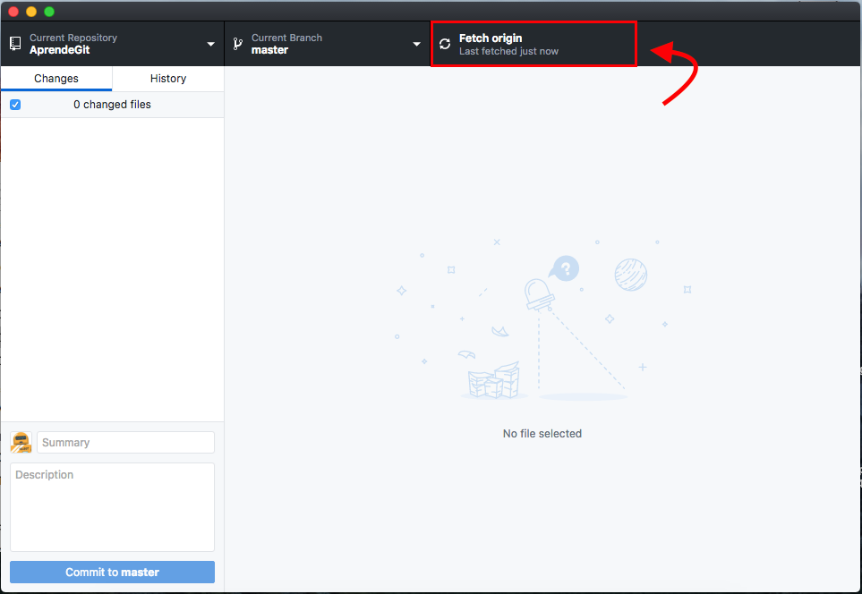
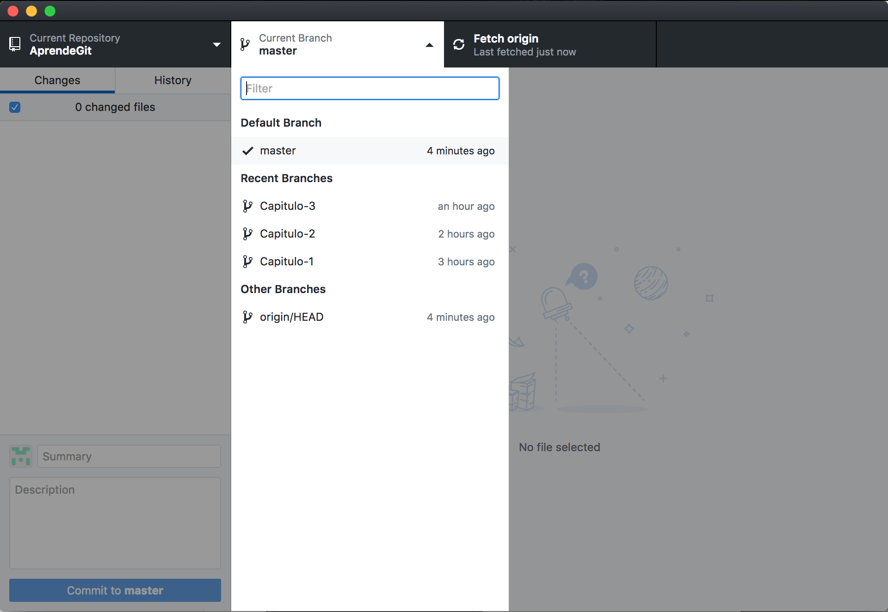
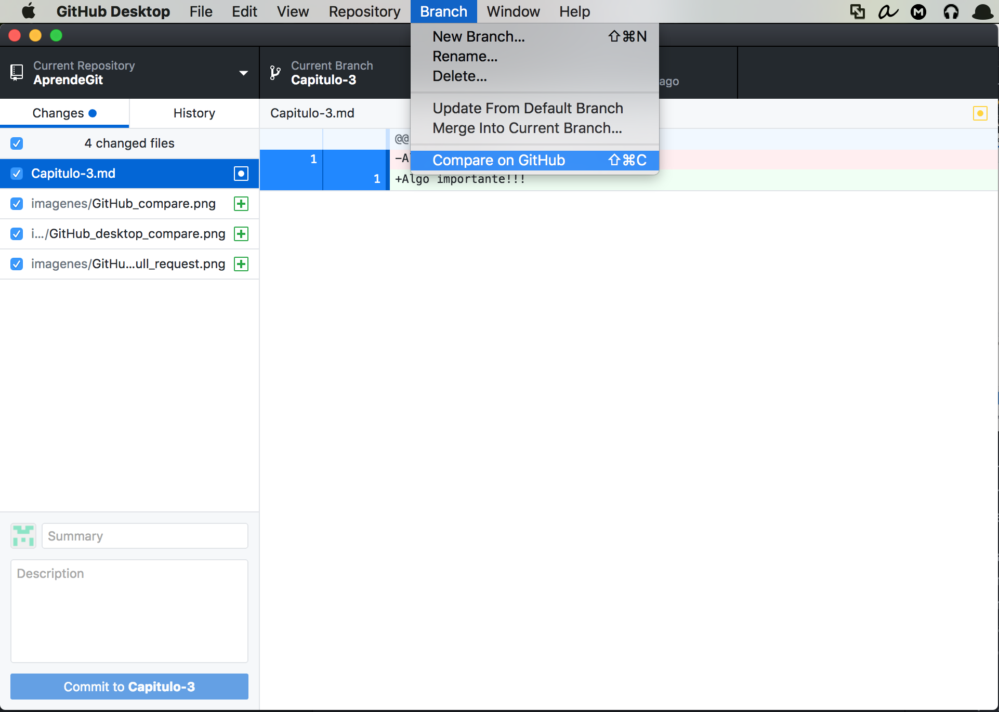
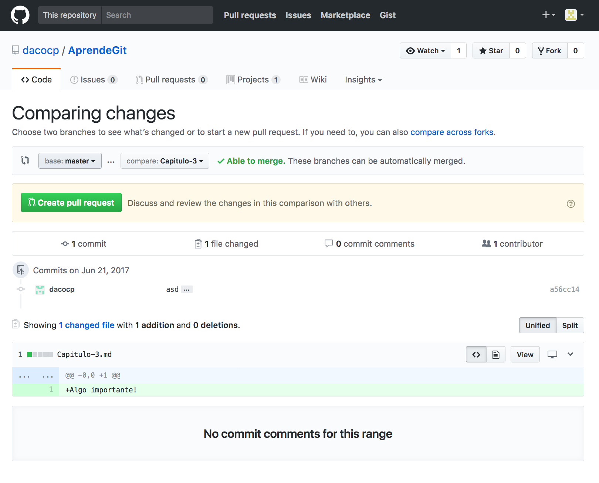
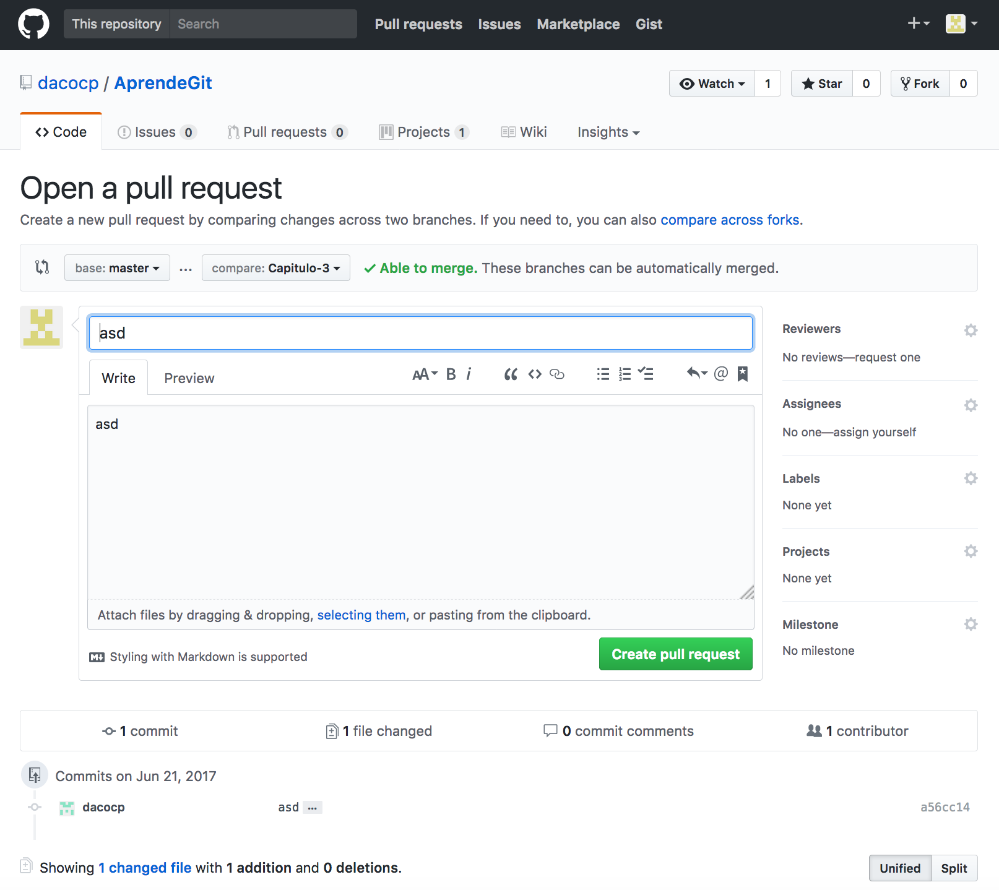
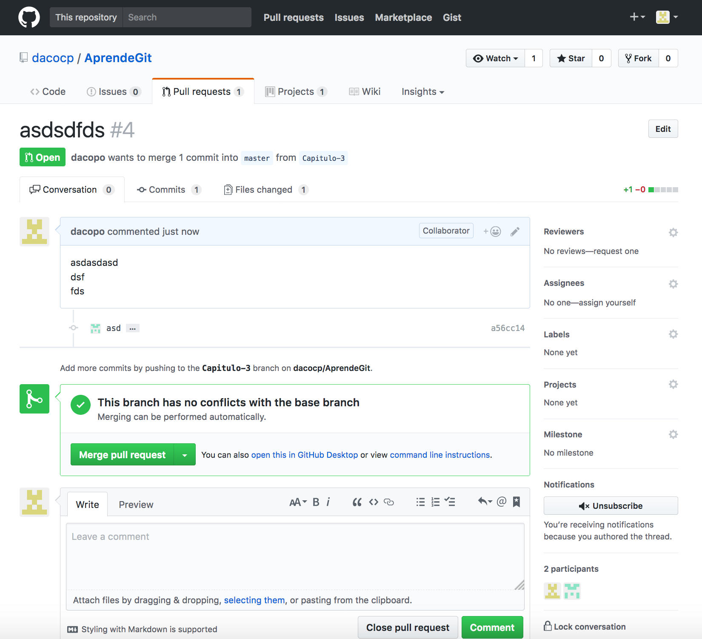

# ¿QUÉ ES GIT?
- Git es un sistema de control de versiones (VCS, por sus siglas en inglés), diseñado para llevar un registro de cambios en los archivos de un proyecto en el que trabajan una o más personas.

- Fue desarrollado por Linus Torvalds, el creador de Linux, en 2005, con el objetivo de ayudar a la comunidad open source a colaborar en proyectos de software, haciendo un manejo y seguimiento de los cambios propuestos por cada participante.

# ¿CÓMO FUNCIONA? / _commits_ y BRANCHES
- Un repositorio Git es un directorio en tu disco duro, en donde los cambios a los archivos son rastreados, de manera que se puede regresar a cualquier versión del pasado.

- Git mantiene el registro de los cambios importantes que ocurren en el repositorio. El usuario trabaja sobre copias de los archivos del proyecto (más sobre esto en la sección "Área de trabajo", más adelante), y cuando está convencido de sus avances hace un _commit_, que actualiza el repositorio para incluirlos. Los _commits_ enviados por el usuario, se van encadenando, uno tras otro, para guardar un histórico completo. Gráficamente, cada _commit_ es un nodo, ligado a un _commit_ anterior y a uno posterior.

- En cualquier momento es posible regresar a cualquier _commit_ y seguir trabajando desde ese punto.

# RAMAS (BRANCHES) y MERGES
- Si un usuario quiere trabajar en una línea paralela, dejando la versión principal de su proyecto intacta, puede generar una nueva rama, a partir de cualquier _commit_ en la historia.

- El usuario que puede elegir a qué rama quiere enviar sus cambios (en qué rama hace sus _commits_).
- La nueva rama puede ser fusionada (_merge_) con la rama _master_ más adelante; sólo será necesario resolver los posibles conflictos, si es que la rama principal también fue modificada. Como se observa en la figura, mientras el usuario trabajó en la rama "Some Feature" haciendo dos _commits_, también hizo un _commit_ en la rama _master_, de manera que al fusionar (_merge_) es posible que tenga que resolver conflictos entre archivos.

# ÁREA DE TRABAJO
- Los nodos (_commits_) en las gráficas anteriores, representan versiones "estables" del proyecto. Es decir, no es deseable que cambios que hace un autor mientras desarrolla sus ideas se vean reflejados de inmediato en las versiones rastreadas por Git.

- Para esto, un repositorio Git, además de rastrear versiones pasadas, tiene un _área de trabajo_ (_workspace_). Los cambios que haga el usuario a los archivos en el _workspace_ no se verán reflejados en ninguna de las ramas rastreadas por Git sino hasta que el autor haga un _commit_, que integrará los cambios hechos en los archivos del _workspace_ a la rama que el usuario elija. El _commit_ actualiza la rama, agregando un nuevo nodo al final.

# ¿CÓMO COLABORAR CON GIT?
- Todo lo que hemos mencionado hasta ahora sucede localmente en la computadora de un usuario. Pero los mismos principios se utilizan para colaborar con un equipo de personas, cada una de las cuales tendrá una copia local del repositorio en su disco duro.
- Flujo de trabajo para colaborar con Git:
 1. Se define un repositorio de origen (_origin_) que puede ser guardado en un servidor propio, o en sitios como GitHub o GitLab.
 2. Los participantes clonan (_clone_) el repositorio _origin_ en sus computadoras, generando una copia local, que pueden modificar sin temor de que sus cambios entren en conflicto con los de otros participantes.
 3. Un colaborador modifica los archivos en su área de trabajo local.
 4. El colaborador hace un _commit_ con estos cambios, actualizando alguna de las ramas de su repositorio local.
 5. El colaborador envía un _pull request_ (ya hablaremos de esto) al repositorio origen, para que los administradores revisen y, en su caso, acepten los cambios y sean integrados (_merge_).
 6. Los demás colaboradores descargan los cambios propuestos (_fetch_), y los integran (_merge_) a sus ramas locales.

# GUÍA PASO A PASO PARA COLABORAR CON GIT Y GITHUB

1. - Ve a https://github.com y crea una cuenta.

 - Descarga e instala el cliente git GitHub Desktop:
   https://desktop.github.com

 - Elige la opción "Sign into Github.com" e los datos de tu cuenta de GitHub
 

 - Elige la opción "Clone a Repository":
 

 - En el primer campo, ingresa la dirección de este repositorio (https://github.com/dacocp/AprendeGit) y en el segundo, la ruta donde desees guardar la copia local (se sugiere dejarlo como está por default). Guarda o memoriza esta ruta, ya que ahí quedarán almacenados los archivos del proyecto.

 - Si todo salió bien, el repositorio Git ha sido _clonado_ a tu disco duro, y podrás ver sus archivos en la ruta que ingresaste (o que dejaste por default) en el inciso anterior.

2. - En la pantalla siguiente puedes interactuar con tu repositorio local para hacer _commits_ y actualizar repositorio local, pero también para interactuar con el repositorio remoto _origin_. Verás  la lista de cambios en tu área de trabajo, que no han sido sincronizados (_commit_) con tu _master branch_. Como el repositorio está recién clonado, debe mostrar: _0 changed files_

 - Es importante actualizar nuestro repositorio local frecuentemente para que nuestra versión local, sobre la que estamos realizando  cambios no se separe mucho de la versión del repositorio central, _origin_, y se más fácil integrarlos más adelante. Para esto, es necesario dar click en el tercer botón de la hilera en la parte superior de la pantalla, "Fetch origin":

3. - Deja la pantalla de GitHub Desktop abierta y en un navegador busca y descarga un editor de Markdown (por ejemplo: http://markdownpad.com). Una vez descargado, instalalo en tu computadora.

 - Abre tu editor de Markdown. Da click en "File" -> "Open". Busca directorio en donde se guardó el clon de este repositorio Git (en el paso 5 elegiste la ruta donde se guardarían los archivos) y abre el archivo "Readme.md". Ahí encontrarás el texto del tutorial que estás leyendo en este momento. Está escrito en formato Markdown, que permite dar formato a textos utilizando etiquetas muy sencillas (por ejemplo, rodear un palabra con guiones bajos, producirá un texto en \__itálicas_\_). Deja esta ventanta abierta y, por lo pronto, regresa a la pantalla de GitHub Desktop.

4. Cuando utilices GitHub para colaborar, hay que seguir buenas prácticas, que faciliten la convivencia y colaboración. En general, es de mala educación modificar la rama _master_ del repositorio público (que es de todos), sin solicitar la revisión de otros colaboradores. Por ello, es buena práctica crear nuevas ramas (_branch_) y trabajar sobre ellas, hasta que las modificaciones propuestas estén suficientemente "maduras". Cuando la versión de la rama que hayas creado esté lista, podrá ser fusionada con la rama principal.

 - Revisa si existen otras ramas activas en el repositorio, dando click en donde dice "Current Branch".
 

5. - Crea una nueva rama para tus cambios. En GitHub desktop, en el menú de hasta arriba, da click en "Branch" -> "New Branch".

 - Escribe el nombre de tu nueva rama, por ejemplo, "Capitulo-2" (los nombres de las ramas no aceptan espacios). Si ya existe una rama con este nombre (por eso te pedí que verificaras las ramas existentes), intenta "Capitulo-3", "Capitulo-4", o algún nombre que describa lo que se va a trabajar en esta rama.

6. - Ahora actualiza el repositorio central de GitHub (_origin_) para publicar esta nueva rama, haciendo un "Push".

 - Esto actualizará el repositorio para todos los colaboradores, que podrán ver que alguien está trabajando en una rama paralela.

 - Asegurate que tu nueva rama esté seleccionada como rama de trabajo (ver paso 12).

7. - Ahora regresa a tu editor Markdown.

 - Ve al final del documento y añade una línea con tu nombre y algún comentario o sugerencia sobre este tutorial.

 - Después, crea un nuevo archivo llamado "Capitulo-2.md" (o algo relacionado con el nombre que le hayas dado a tu nueva rama) y guárdalo en la misma carpeta donde se encuentra "Readme.md".

 - Escribe algo importante en tu nuevo archivo.

 - Guarda el archivo y vuelve a la ventana de GitHub Desktop.

8. - En GitHub Desktop notarás que los cambios que hiciste en "Readme.md" fueron detectados.

 - En la parte izquierda, encontrarás la lista de archivos que fueron modificados. En este caso, si modificaste el archivo "Readme.md" y creaste un nuevo archivo, deberás encontrarlos aquí.

 - Puedes hacer click en cada uno de ellos, para ver los cambios dentro de ese archivo en la parte derecha de la pantalla. Con fondo rosa y precedido con un símbolo "-", verás el contenido eliminado, y en verde precedido por "+" encontrarás el contenido agregado.

 - Si das click derecho sobre los archivos de la lista a la izquierda, aparecen otras opciones. La palomita (o su ausencia) a la izquierda del nombre de cada archivo los incluye o excluye de un _commit_. Asegúrate que todos los archivos que modificaste estén palomeados.

9. - Ahora, haremos el _commit_ de los cambios que hiciste en tus archivos para que queden a la cabeza de tu rama local _Capitulo-2_ (o como le hayas llamado) y rastreados por Git como una nueva versión.

 - En la parte inferior izquierda de la pantalla, verás un cuadro de texto donde ingresar un resumen ("Summary") y una descripción más elaborada ("Description", opcional).

 - Escribe un resumen y una descripción (opcional) de tu _commit_ y da click en el boton de abajo ("Commit to <'nombre de la rama'>").

10. - Si todo salió bien, volverás a ver "0 changed files" y la pantalla vacía, y bajo del boton aparecerá una leyenda que dice "Commited just now". El botón de "Undo", a la derecha, te permite arrepentirte de tu _commit_ más reciente.

 - Si tu nuevo capítulo está listo para ser compartido con el resto de los colaboradores, ahora podemos hacer un _push_, que lo enviará al repositorio central _origin_, en la rama que creaste.

11. - Después de hacer el _commit_, el tercer botón de la hilera de arriba (que se encarga de la interacción con el servidor Git central, _origin_), dirá "Push origin", y el ícono en la parte derecha tendrá un número 1, que es el número de _commits_ pendientes de sincronizar con el servidor.

 - Da click en él.

 - Tu nuevo contenido ahora se encuentra en el servidor central (en GitHub, en este caso), bajo la rama que tú creaste y listo para que otros, al actualizar sus repositorios reciban tus cambios y puedan empezar a colaborar con tu capítulo.

12. - Una vez que tu capítulo esté terminado será necesario integrarlo a la rama _master_, es decir, vamos a hacer un _merge_ entre nuestra nueva rama y la rama master, pero para esto vamos a pedir a otros colaboradores que revisen la propuesta de cambios y acepten las modificaciones o indiquen comentarios pertinentes.

 - Ve a la ventana de GitHub Desktop y regresa a al rama _master_ (ver el inciso 13).

 - Al regresar a esta rama, deberás notar que tu archivo "Capitulo-2.md" (o el nombre que hayas usado), sobre el que estuviste trabajando, ha desaparecido. Esto es porque, si seguiste los pasos de esta guía adecuadamente, tus cambios se encuentran dentro del repositorio en tu nueva rama, y al cambiar de rama te presenta los archivos como están en la versión de la rama _master_.

 - No te apures, vuelve a la ventana de GitHub Desktop y vuelve a cambiar a tu rama "Capitulo-2" (o el nombre que hayas usado), y el archivo volverá a aparecer en tu _workspace_.

 - Es por esto que queremos fusionar las ramas, para que nuestro capítulo ya aparezca en la versión "oficial" (_master_) del documento.

13. - Ya que estés de nuevo en tu rama, vamos a pedir a nuestros colaboradores que revisen la actualización propuesta, antes de fusionarla con la rama _master_.

 - Para esto, ve al menú principal y da click en "Branch" -> "Compare on GitHub".

 - Esto abrirá una ventana de navegador, en una página de GitHub que indica las diferencias entre nuestra rama, con la rama _master_ del servidor central. Todos los archivos que hayan sido añadidos o modificados aparecerán ahí, mostrando, como en el inciso 16, los cambios en el texto de los archivos (si son archivos de texto).

 - Da click en "Create pull request", para que otros colaboradores revisen esta propuesta de modificación para que, en su caso, la aprueben, o sugieran cambios pertinentes.

14. - El "Pull request" es creado, solicitando la fusión de las dos ramas. En la pantalla ahora se mostrarán los datos del "Pull request", y su creador puede escribir comentarios adicionales describiendo sus modificaciones.

- En la parte derecha de la ventana en "Reviewers", se puede solicitar que uno o más colaboradores hagan la revisión. Será necesario teclear su nombre de usuario y ellos recibirán un mail de notificación. El o los "Asignees", usualmente se eligen de entre los colaboradores que más participaron en el desarrollo de esta rama (y este "Pull request" en particular).

 - Agrega a algún colaborador en tu lista de "Reviewers" y da click en "Create pull request".

15. - A continuación nos mostrará el "Pull request" creado.

 - El creador del "Pull request" no debería ser quien lo revise y apruebe haciendo el _merge_, sino algun otro colaborador. Pero para continuar con esta guía lo revisaremos nosotros mismos. Si se te cierra la página donde estabamos, puedes regresar a ella facilmente. En la página de GitHub de nuestro repositorio (https://github.com/dacocp/AprendeGit, en nuestro caso), hay una pestaña que dice "Pull requests", en donde podemos encontrar todos los "Pull requests", aunque no nos hayan puesto como revisores.

 - En la página, podrás notar que hay lugar para escribir comentarios de ida y vuelta con los demás colaboradores que lo estén revisando. Además, en la parte superior podemos ver tres pestañas "Conversation", "Commits" y "Files changed", en donde se pueden explorar a fondo los cambios propuestos. Si todo se ve bien y deseas integrar los cambios a la rama _master_, da click en "Merge pull request".

16. - Cuando un pull request en verdad es requerido por algún colaborador (en vez de que estar revisando nuestras propias modificaciones), la página hasta arriba tendrá un boton indicando "Add your review".

 - Al dar click en este botón nos llevará a la siguiente página, en donde podemos editar directamente los archivos propuestos, y al final dar un dictamen, como se muestra en la imagen.

 - El dictamen será enviado al que generó el "Pull request" para que, en su caso, haga las modificaciones que se indiquen.

Ahora, por favor ayudame a mejorar este documento mientras aprendes a utilizar Git y GitHub, unas de las herramientas más poderosas de colaboración que existen!

Mi mail nombre de usuario en GitHub es __dacocp__, para que me pongas como revisor de tus cambios propuestos, y pueda ayudarte con tus problemas.

Y siempre recuerda que es de mala educación publicar a la _master branch_ sin preguntar!
